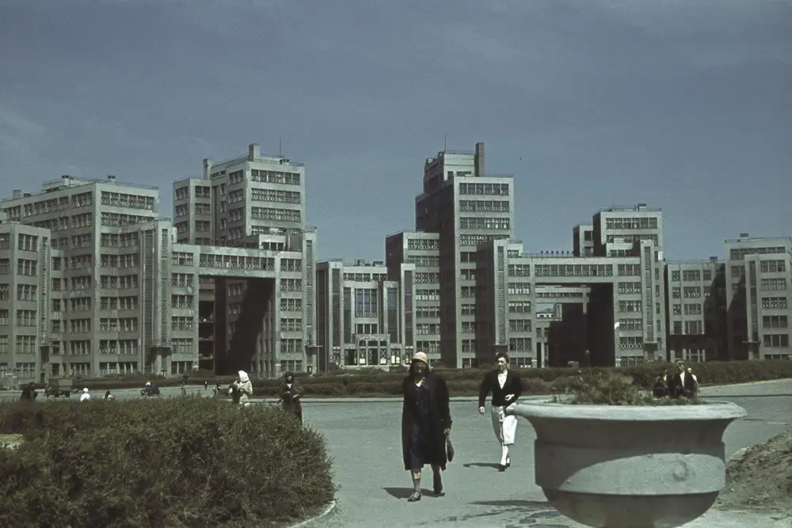
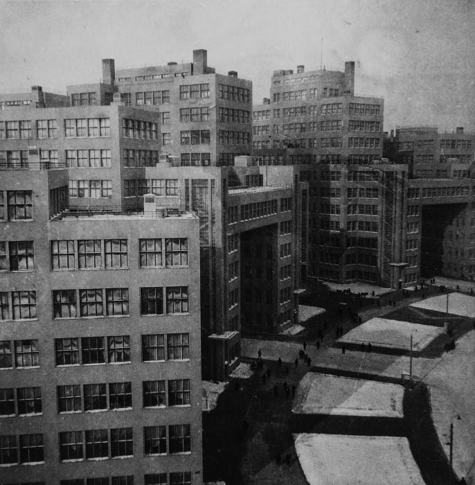
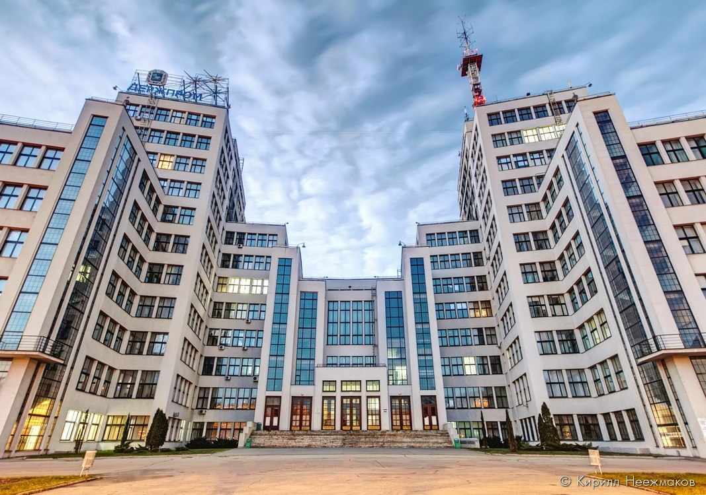
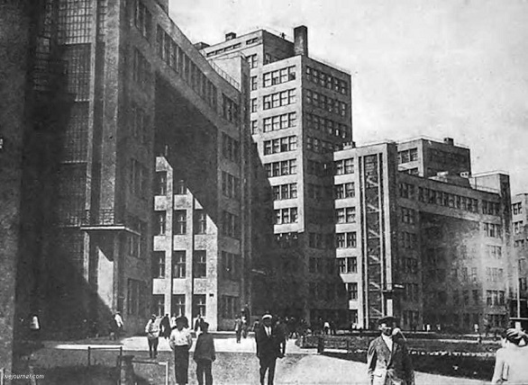
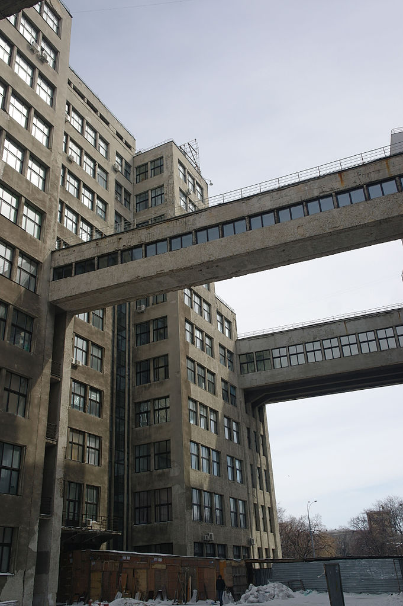
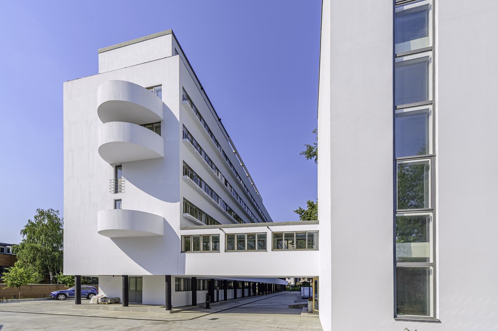
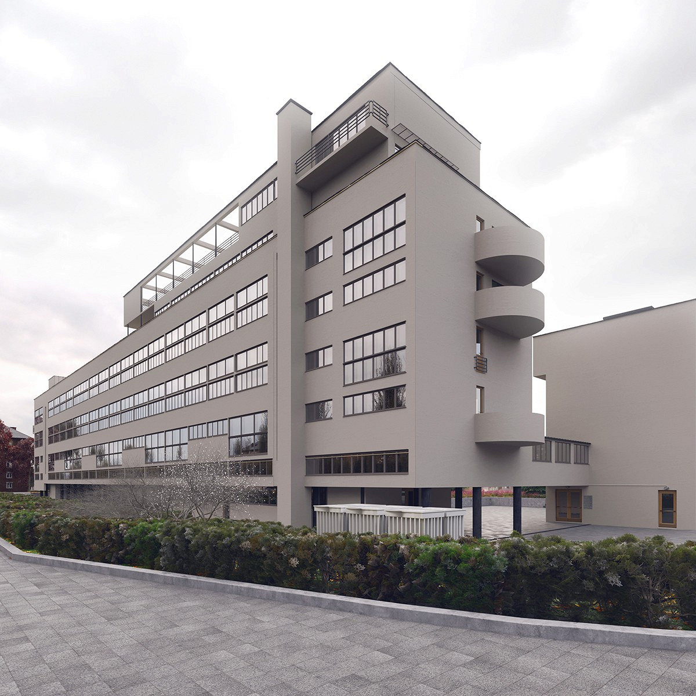
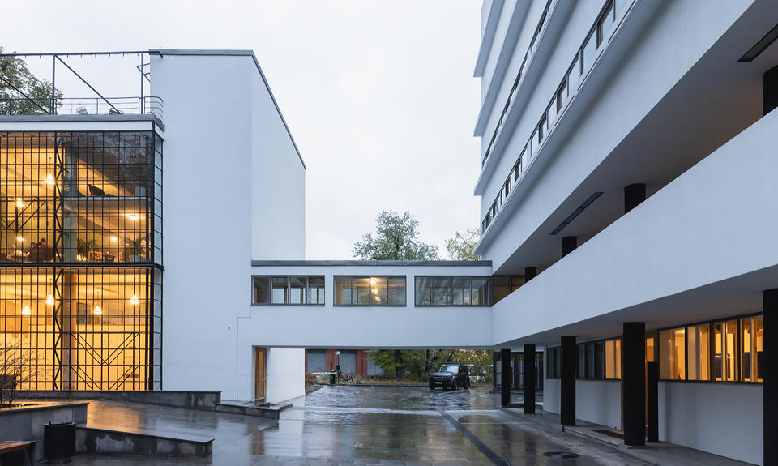

# Architecture

## Здание Госпрома

### Assets

- 
- 
- 
- 
- 

### Content

Харьковский Дом Государственной промышленности проектировался для «паевого товарищества строительства и эксплуатации домов госпромышленности в городе Харькове», в которое входили 22 государственных треста, Промышленный банк, Внешторг и Госторг Украинской ССР (в то время Харьков был столицей Украинской ССР).

Проект Дома Государственной промышленности был выбран в результате конкурса, который был объявлен 5 мая 1925 года. Авторами конкурсной программы являлись инженер-строитель Я. И. Кенский и профессор Харьковского технологического института А. Г. Молокин. На конкурс было представлено 19 проектов. 1-ю премию получил проект «Незваный гость» ленинградских архитекторов Сергея Саввича Серафимова, Самуила Мироновича Кравца и Марка Давидовича Фельгера.

Здание построено в рекордно короткие сроки — подготовительные работы начались летом 1925 года, сдача в эксплуатацию — 7 ноября 1928 года, к одиннадцатой годовщине Октябрьской революции. 8 мая 1926 года стройку посетил председатель ОГПУ СССР и Высшего совета народного хозяйства СССР Феликс Дзержинский. На торжественной закладке центрального корпуса, которая произошла 21 ноября 1926 года, зданию присвоили его имя.

Создание такого значительного объекта стало возможно благодаря главному инженеру строительства — П. П. Роттерту. Под его руководством на стройке были разработаны рабочие чертежи уникальной конструкции, проведена механизация работ (до 80 %), подготовлены специалисты — квалифицированные рабочие и инженеры, разработана технология индустриального железобетона и т. д.

## Дом Наркомфина

### Assets

- 
- 
- 