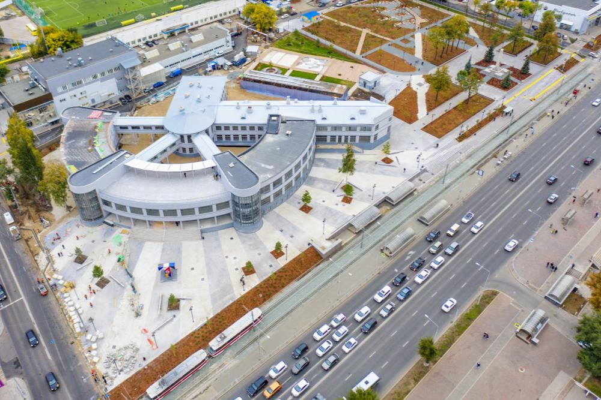
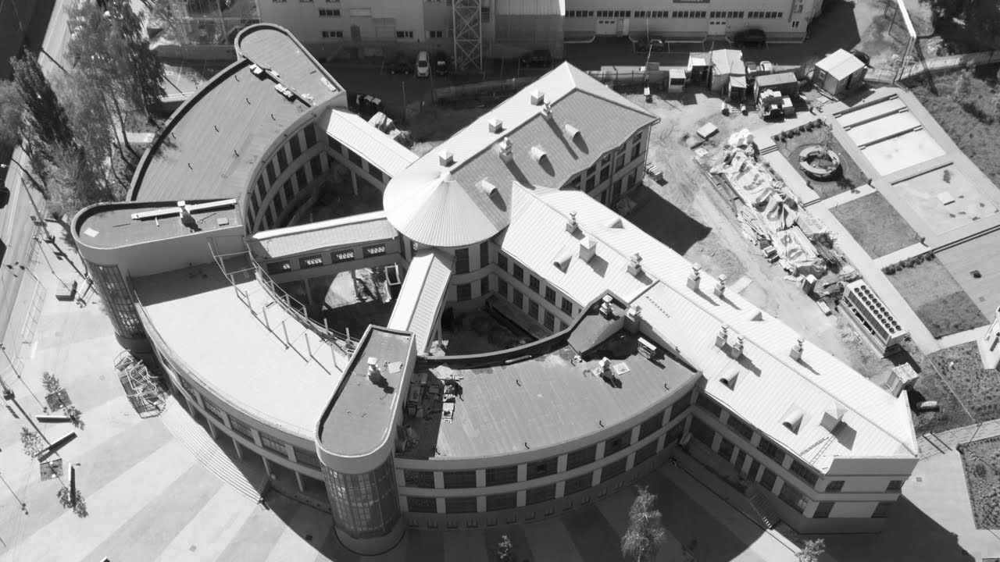

# Architecture

## Здание Госпрома

### Assets

- 
- 
- 
- 
- 

### Content

Харьковский Дом Государственной промышленности проектировался для «паевого товарищества строительства и эксплуатации домов госпромышленности в городе Харькове», в которое входили 22 государственных треста, Промышленный банк, Внешторг и Госторг Украинской ССР (в то время Харьков был столицей Украинской ССР).

Проект Дома Государственной промышленности был выбран в результате конкурса, который был объявлен 5 мая 1925 года. Авторами конкурсной программы являлись инженер-строитель Я. И. Кенский и профессор Харьковского технологического института А. Г. Молокин. На конкурс было представлено 19 проектов. 1-ю премию получил проект «Незваный гость» ленинградских архитекторов Сергея Саввича Серафимова, Самуила Мироновича Кравца и Марка Давидовича Фельгера.

Здание построено в рекордно короткие сроки — подготовительные работы начались летом 1925 года, сдача в эксплуатацию — 7 ноября 1928 года, к одиннадцатой годовщине Октябрьской революции. 8 мая 1926 года стройку посетил председатель ОГПУ СССР и Высшего совета народного хозяйства СССР Феликс Дзержинский. На торжественной закладке центрального корпуса, которая произошла 21 ноября 1926 года, зданию присвоили его имя.

Создание такого значительного объекта стало возможно благодаря главному инженеру строительства — П. П. Роттерту. Под его руководством на стройке были разработаны рабочие чертежи уникальной конструкции, проведена механизация работ (до 80 %), подготовлены специалисты — квалифицированные рабочие и инженеры, разработана технология индустриального железобетона и т. д.

## Дом Наркомфина

### Assets

- 
- 
- 

### Content
Дом Наркомфи́на — один из знаковых памятников архитектуры советского авангарда и конструктивизма. Построен в 1928—1930 годах по проекту архитекторов Моисея Гинзбурга, Игнатия Милиниса и инженера Сергея Прохорова для работников Народного комиссариата финансов СССР (Наркомфина). Автор замысла дома Наркомфина М. Я. Гинзбург определял его как «опытный дом переходного типа». Дом находится в Москве по адресу: Новинский бульвар, дом 25, корпус 1.

С 1980-х годов дом находился в аварийном состоянии, был трижды включён в список «100 главных зданий мира, которым грозит уничтожение». В 1986 начато исследование и работа над проектом реставрации дома по инициативе Владимира Гинзбурга; в 1998 году проект отмечен первой премией фестиваля «Зодчество». В 2016—2020 годах дом отреставрирован по проекту АБ «Гинзбург Архитектс». Результаты исследования и реставрации опубликованы. Сейчас Дом Наркомфина — и памятник архитектуры, и жилой дом.

В 2021 году Музей современного искусства «Гараж» инициировал масштабное исследование Дома Наркомфина, в том числе истории жизни его создателей и обитателей на протяжении почти ста лет. Полученное знание становится основой экскурсионных маршрутов, публикаций, разнообразных публичных и просветительских проектов, выстроенных вокруг легендарного дома. Помимо этого, для жильцов дома, патронов Музея и владельцев карт GARAGE доступно кафе Дома Наркомфина, а на первом этаже жилого корпуса открылся книжный магазин.

## Василеостровская фабрика-кухня

### Assets
- 
- 

### Content
Василеостровская фабрика-кухня — это шедевр советского конструктивизма, построенный в 1930–1931 годах архитекторами А. К. Барутчевым, И. А. Гильтером, И. А. Меерзоном и инженером А. Г. Джоакимом.Главная идея здания заключалась в радикальной перестройке быта и освобождении женщины от «домашнего рабства». 

Основная концепция здания строилась на трех принципах:
1. Индустриализация питания: Кулинария превращалась в механизированное фабричное производство. Здание было спроектировано как непрерывный «конвейер»: на цокольном этаже принимали сырье, на первом его обрабатывали, а на втором находились огромные обеденные залы.
2. Функциональное зонирование: Форма здания полностью повторяла его внутренние процессы. Четкие геометрические объемы разделяли производственные цеха, залы для обедов, магазины полуфабрикатов и администрацию .
3. Социальный центр: Это было не просто предприятие общепита, а новое общественное пространство. Здесь работали библиотека, вечерние курсы, а на плоской крыше-террасе в теплое время года обустраивали обеденные столы на открытом воздухе
