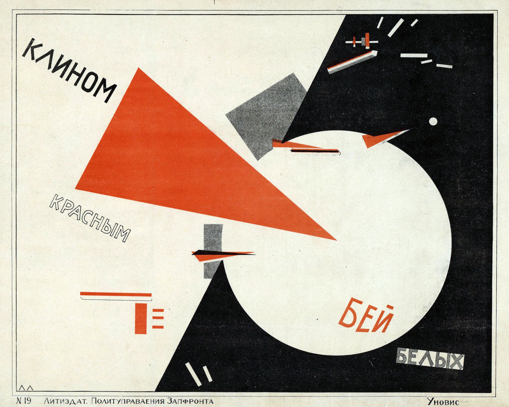
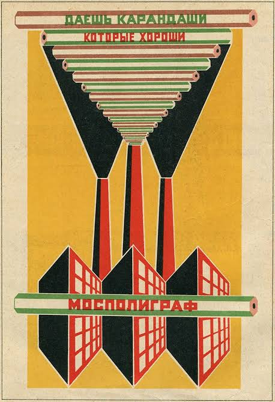
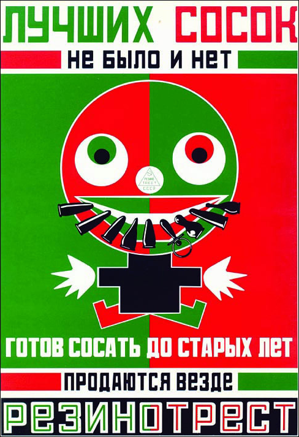
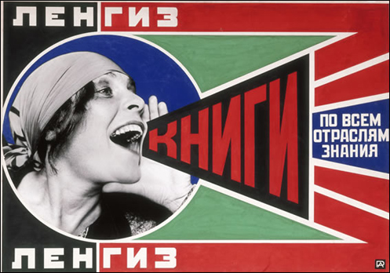
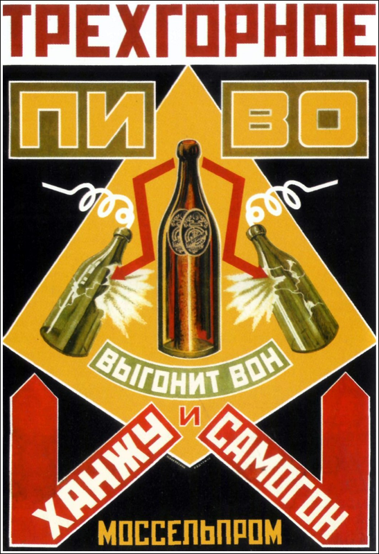

# Posters

## Клином красным бей белых

### Assets

- 

### Content

Плакат создан в 1919 году, то есть немного раньше основного периода конструктивизма, но он стал одной из его ключевых визуальных моделей. Состоит из геометрических фигур в трёх цветах: красном, белом и чёрном. Фон разделён на две части: на тёмной левой стороне покоится белый круг, на светлой как будто движется красный треугольник, который клином таранит белую окружность. Круг и треугольник — метафорическое изображение материальных понятий: Белой и Красной армии. Классическая устойчивая форма (круг), дополненная асимметричной деталью (клин), которая разрушает равновесие всего образа и тем самым придаёт ему незавершённость и динамику — это сегодня традиционный модернистский приём, рождённый в художественном эксперименте Эль Лисицкого.
Одно из самых известных его переосмыслений — плакат Александра Родченко «Ленгиз: книги по всем отраслям знания».

## Плакаты с слоганами Маяковского
- 
- 
- 
- 
